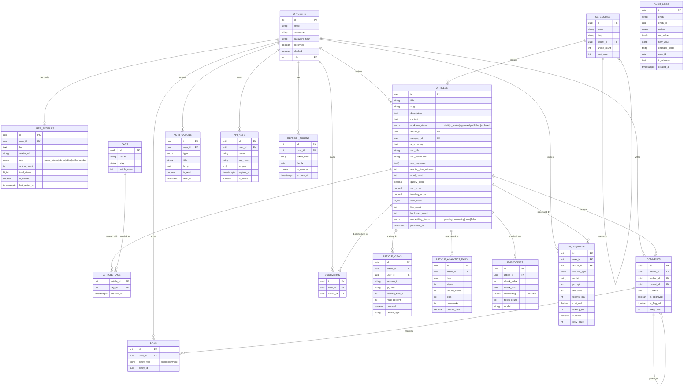

# Entity-Relationship Diagram — AI Content Intelligence Platform

## Full ER Diagram

---

## Key Relationships

| Relationship | Type | Notes |
|-------------|------|-------|
| User → Articles | 1:Many | Author ownership |
| Articles → Categories | Many:1 | Single category per article |
| Articles → Tags | Many:Many | Via `article_tags` join |
| Articles → Embeddings | 1:Many | Multiple chunks per article |
| Comments → Comments | Self-referential | Threading via `parent_id` |
| Likes | Polymorphic | `entity_type` + `entity_id` pattern |
| Audit Logs | Immutable | Insert-only, tracks all changes |
