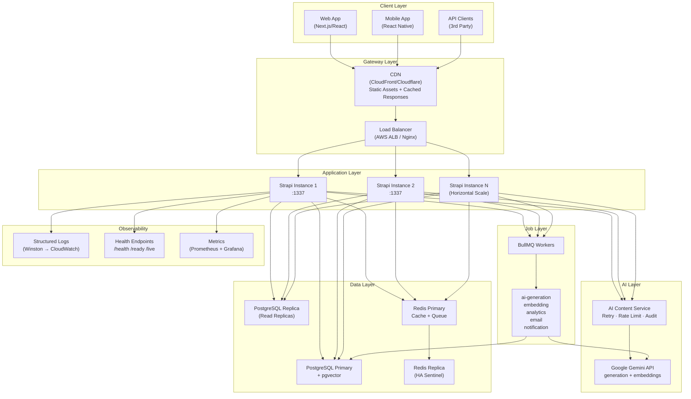

# High-Level Design — AI Content Intelligence Platform

## System Overview

An AI-powered Content Management + Intelligence Platform capable of handling 100k+ articles, 10k+ concurrent users, with sub-100ms cached reads and AI-powered content operations.

---

## Key Design Decisions

### 1. PostgreSQL + pgvector (Not Separate Vector DB)

**Decision:** Use pgvector instead of Pinecone/Weaviate/Qdrant.

**Rationale:**
- Eliminates cross-service consistency issues (one DB = ACID guarantees)
- Joins between vectors and metadata are native SQL — no fan-out queries
- IVFFlat/HNSW indexes provide adequate performance for < 10M vectors
- Simpler infrastructure, lower cost

**Scale threshold:** At ~10M+ vectors with strict sub-10ms P99 requirements, migrate to dedicated vector DB.

---

### 2. Strapi v5 as API Framework (Not Raw Express/Fastify)

**Decision:** Extend Strapi rather than build from scratch.

**Rationale:**
- Admin UI out of the box (content editing, media library)
- Role-based permissions built in
- Plugin system enables clean modular architecture
- Document-based ORM abstracts DB layer

**Risk mitigation:** All AI + search + analytics logic is in isolated custom plugins — zero Strapi lock-in for core business logic.

---

### 3. BullMQ for Job Queue (Not SQS/RabbitMQ)

**Decision:** BullMQ over cloud-native queues.

**Rationale:**
- Built on Redis (already required for caching) — no new infrastructure
- Excellent retry/backoff/dead-letter support
- Bull Board UI for observability
- For scale > 1M jobs/day, migrate to SQS + Lambda

---

### 4. Hybrid Search (Semantic + BM25)

**Decision:** Implement both semantic (vector) and keyword (BM25) search, combined via Reciprocal Rank Fusion (RRF).

**Rationale:**
- Pure semantic search fails on specific product names, acronyms, new terms
- Pure keyword search fails on concept-level queries
- RRF fusion outperforms both individually (research-backed)

---

## Scaling Strategy

### Phase 1: Single Server (Current)
- 1 Strapi instance + 1 Postgres + 1 Redis
- Handles ~100 req/s

### Phase 2: Read Scaling (1k req/s)
- Add read replicas for Postgres
- Increase Redis cluster size
- Add CDN for API responses

### Phase 3: Horizontal Scaling (10k req/s)
- Multiple Strapi instances behind load balancer
- Postgres PgBouncer connection pooler
- Redis Sentinel or Cluster
- Kubernetes HPA on CPU/memory

### Phase 4: Data Partitioning (100k req/s)
- Article table partitioned by `published_at` range
- Analytics in separate read-optimized DB (TimescaleDB)
- Vector store migrated to dedicated service (Qdrant/Pinecone)
