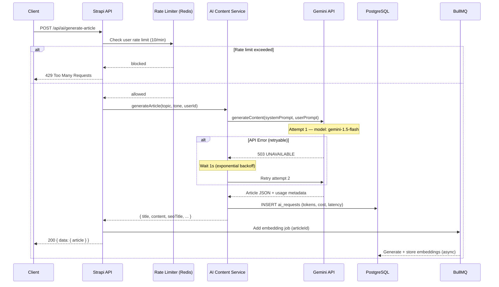
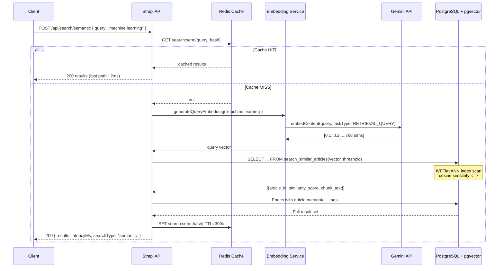
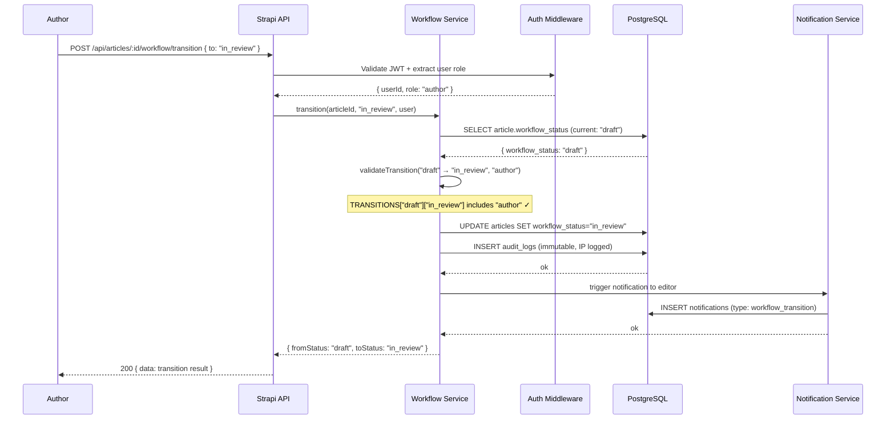
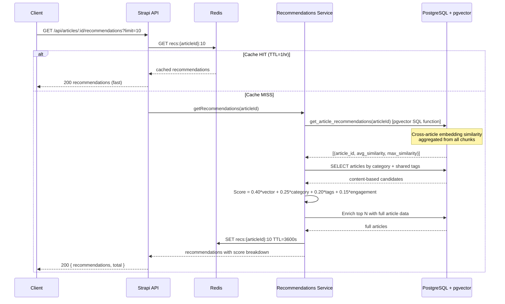
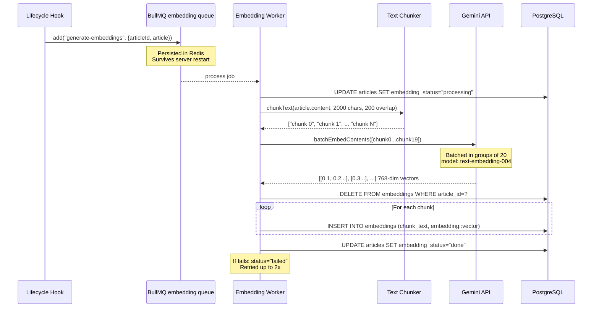
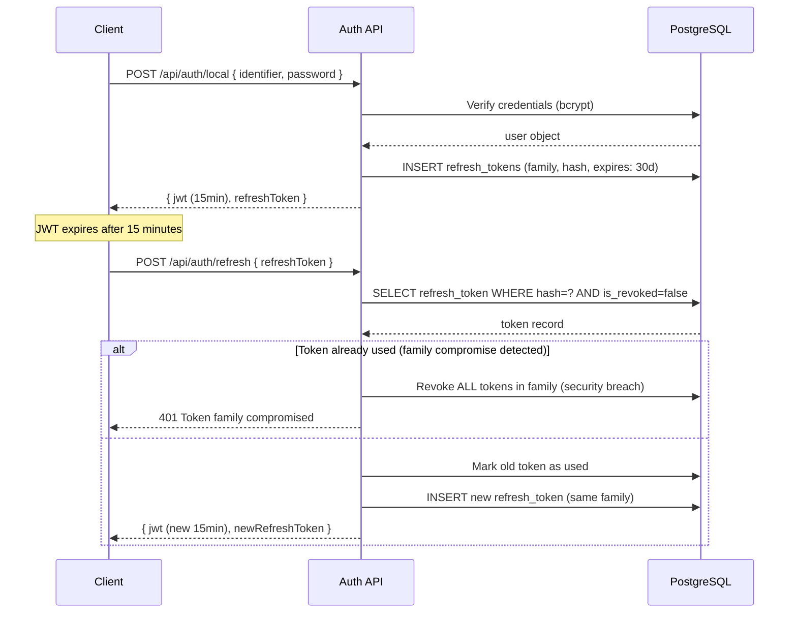

# Sequence Diagrams — AI Content Intelligence Platform

## 1. AI Article Generation Flow

---

## 2. Semantic Search Flow

---

## 3. Content Workflow Transition

---

## 4. Recommendation Engine

---

## 5. Embedding Generation (Background Job)

---

## 6. Authentication + Refresh Token Flow

